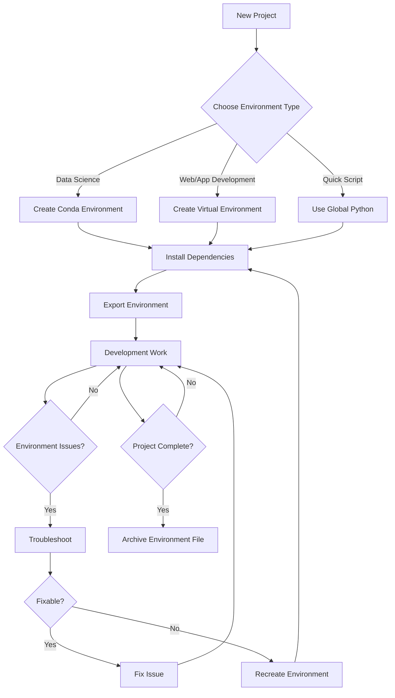

# Python Environment Management Workflow

The following diagram illustrates a typical workflow for managing Python environments:

This workflow shows the decision points and processes involved in managing Python environments throughout a project lifecycle.